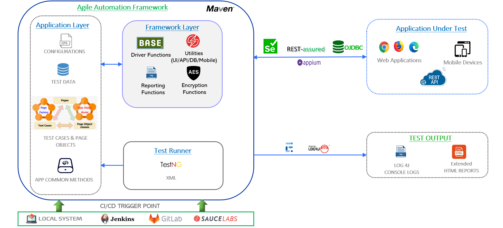

#Agile Automation Framework

Agile Automation Framework (AAF) is an One Stop Solution for DT automation requirements. AAF is an open source framework supporting � Web / Mobile / API / DB testing automation needs and developed based on Java, Selenium, Rest Assured, TestNG, Maven, Page Factory module principals, enables teams to fully utilize the robust libraries. 

AAF divided into 2 layers, each layer is segregated and isolated to maintain the transparency. First layer is framework layer consist of all reusable framework classes and methods which can be used across all	the application.
Second layer is application layer which consist of all application related test cases, POM, application specific functions, data files and configuration file. 

AAF is built using a very thin, less complicated, robust, flexible, and extensible architecture that supports parallel development and parallel execution of automation suites. Framework can be integrated with GitLab and Jenkins(any other CI\CD tool) to support continuous integration (CI) and Continuous deployment (CD) and Jira with ZAPI. 

## Architecture
